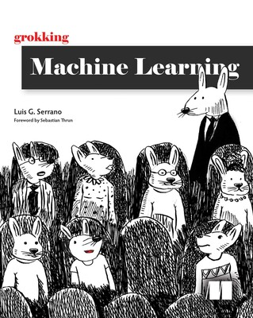

# Grokking Machine Learning Book Repository
This is the repo for the book "Grokking Machine Learning", available [here](https://www.manning.com/books/grokking-machine-learning).

Get it with a 40% discount code: **serranopc**

### Chapters:

1. What is machine learning?
2. Types of machine learning
3. Drawing a line close to our points: **Linear regression** [(code)](https://github.com/rahiakela/machine-learning-research-and-practice/tree/main/grokking-machine-learning/03-linear-regression)
4. Optimizing the training process: **Underfitting**, **overfitting**, **testing**, and **regularization** [(code)](https://github.com/rahiakela/machine-learning-research-and-practice/tree/main/grokking-machine-learning/04-optimizing-training-process)
5. Using lines to split our points: **The perceptron algorithm** [(code)](https://github.com/rahiakela/machine-learning-research-and-practice/tree/main/grokking-machine-learning/05-perceptron-algorithm)
6. A continuous approach to splitting points: **Logistic classifiers** [(code)](https://github.com/rahiakela/machine-learning-research-and-practice/tree/main/grokking-machine-learning/06-logistic-regression)
7. How do you measure classification models?: **Accuracy** and its friends
8. Using probability to its maximum: The **Naive Bayes** model [(code)](https://github.com/rahiakela/machine-learning-research-and-practice/tree/main/grokking-machine-learning/08-naive-bayes-model)
9. Splitting data by asking questions: **Decision trees** [(code)](https://github.com/rahiakela/machine-learning-research-and-practice/tree/main/grokking-machine-learning/09-decision-trees)
10. Combining building blocks to gain more power: **Neural networks** [(code)](https://github.com/rahiakela/machine-learning-research-and-practice/tree/main/grokking-machine-learning/10-neural-networks)
11. Finding boundaries with style: **Support vector machines** and the **kernel method** [(code)](https://github.com/rahiakela/machine-learning-research-and-practice/tree/main/grokking-machine-learning/11-support-vector-machines)
12. Combining models to maximize results: **Ensemble learning** [(code)](https://github.com/rahiakela/machine-learning-research-and-practice/tree/main/grokking-machine-learning/12-ensemble-learning)
13. Putting it all in practice: A real life example of **data engineering** and **machine learning** [(code)](https://github.com/rahiakela/machine-learning-research-and-practice/tree/main/grokking-machine-learning/13-data-engineering-and-machine-learning)